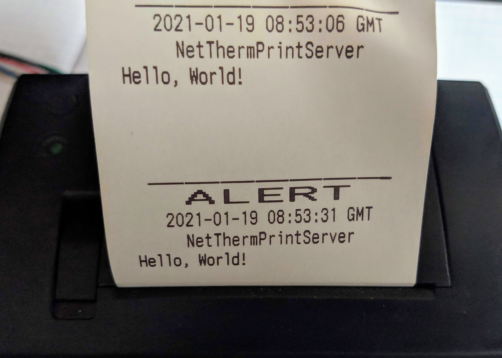

# netthermprint_server
## What it is?
Server compatible with libnetthermprint

## How to run it?
```
docker build -t netthermprint_server .
docker run -p 41231:41231 -p 41230:41230/udp netthermprint_server
```
## Usage
Send request to the url below (for example with wget, curl or web browser):
```
http://[CONTAINER_IP]:41231/?special=[0 is normal, 1 is ALERT]&title=[NOTIFICATIONTITLE]&content=[NOTIFICATIONCONTENT]
```
Example:
```
http://172.16.1.10:41231/?special=0&title=NetThermPrintServer&content=Hello, World!
```

```
http://172.16.1.10:41231/?special=1&title=NetThermPrintServer&content=Hello, World!
```


